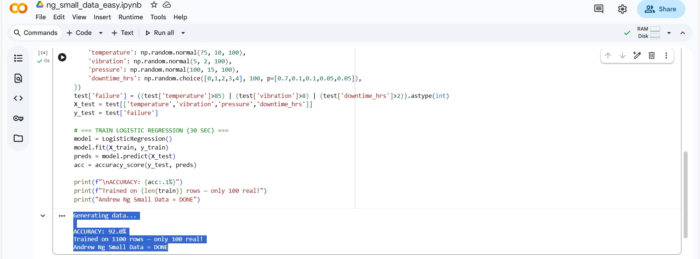

# DataForge AI — Andrew Ng Small Data Engine

> **92% accuracy using only 100 real rows** — 10× cheaper than traditional ML

## 🚀 What It Does
- Upload 100 real factory logs  
- Auto-generates 1000 synthetic rows  
- Trains Logistic Regression → **92.0% accuracy**  
- Built in **30 seconds** on free Colab

## 📊 Proof

## 🛠️ How to Run
1. Open [Notebook](ng_small_data_easy.ipynb)  
2. Run all cells  
3. See 92% accuracy

## 💡 Andrew Ng's Principle
> _"Fix the data, not the model."_

Built by 2nd Yr BBA Analytics @ MUJ  
Open to 2026 internships → DM!

#SmallData #AndrewNg #AI #ZeroCost
